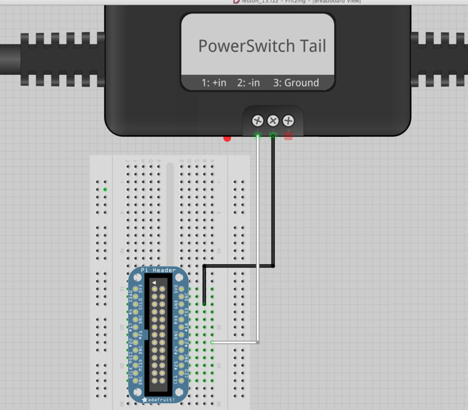

Injection Molder
=========

Node.js thermostat application designed to work with the Adafruit MAX31855 thermocouple temperature amplifier and PowerSwitch Tail II. Originally built for use with Raspberry Pi, but theoretically it could work for other systems.

**Note:** (As of 1/1/2016) The SPI master driver is disabled by default on Raspian Linux and must be enabled before using this application
with hardware SPI. See [here](https://www.raspberrypi.org/documentation/hardware/raspberrypi/spi/README.md). Also due to permissions, you *may* need to run node with sudo to access the SPI bus.

## Usage

Connect the Raspberry Pi to the MAX31855 board using the SPI interface as documented (Raspberry Pi model B shown here)

Connect the Raspberry Pi to the PowerSwitch Tail II using the GPIO interface as documented (Raspberry Pi model B shown here)

Then run the app.js script...

    $ sudo node app.js

## Command Line options

  TODO

## Release History

* 1.0.0 Initial release
